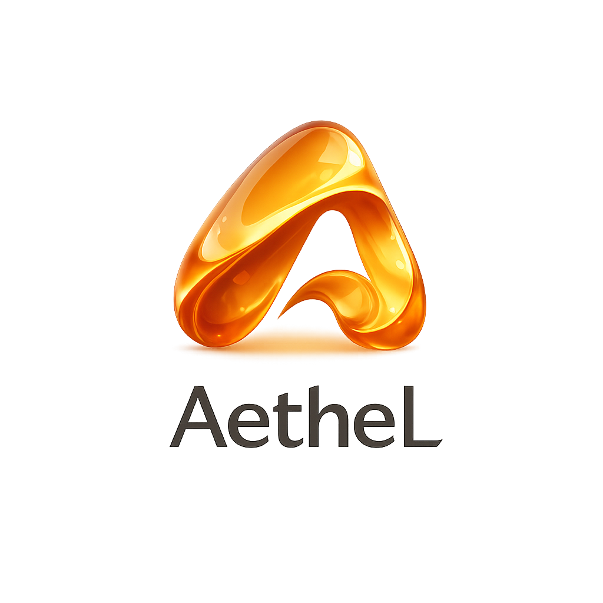

# AetheL：面向产品构思的 AI 认知工作区

<p align="center">
  
</p>

[English README](./README.en.md) | [主 README](./README.md)

## 项目概述

**AetheL** 是一款面向产品构思的 AI 认知工作区。它以“气泡”为思维载体，帮助产品经理、创业者、设计师和构建者捕捉早期想法，通过 AI 追问澄清目标、用户、场景、约束与风险，将逐渐浮现的逻辑压缩为认知快照，并把选定的思考线索生成结构化 PRD 草稿。

AetheL 关注的是产品创造过程中最混乱也最关键的阶段：想法还不稳定，材料不断变化，团队需要保存推理过程，而不只是保存最后的文档。

## 核心功能

- **产品构思气泡空间**：以轻量气泡记录假设、用户场景、限制条件、风险、证据和开放问题。
- **AI 智能归类与关系检测**：自动分析气泡关联，推荐标签，并识别相关、重复或矛盾的内容。
- **认知快照系统**：生成带有语义摘要、认知锚点、逻辑层级、追问和下一步行动的快照。快照生成使用独立的 `snapshot-large` AI task profile，并带有更严格的 schema 校验。
- **创意工坊**：把一句话想法、粗糙笔记、PRD 草稿和上传资料转换为结构化候选气泡。
- **PRD 输出中心**：基于选中气泡束生成可编辑 PRD 章节，保留来源上下文，并支持 Markdown / PDF 导出。
- **AI 追问循环**：围绕目标用户、使用场景、成功标准、依赖关系和风险提出上下文追问。
- **本地长期知识存储**：气泡和快照保存为 Markdown 文件，画布布局和运行态保存为 JSON。
- **多 AI 服务商配置**：支持 ModelScope、DeepSeek、Moonshot；未设置 `AI_PROVIDER` 时，会按已配置 key 自动选择服务商。

## 产品工作流

```text
粗糙想法 / PRD 草稿 / 外部资料
  -> 创意工坊 AI skill
  -> 候选气泡
  -> 灵感气泡画布整理、追问、归类、快照
  -> PRD 输出中心按标签或分类分束
  -> 可编辑章节草稿
  -> Markdown / PDF 导出
```

## 关键页面

- **灵感气泡（`/`）**：主认知画布，用于捕捉、选择、编辑、删除、归类和扩展产品思考气泡。
- **创意工坊（`/workshop`）**：输入变换层，用于把想法、文件和草稿转换为结构化产品气泡。
- **PRD 输出（`/prd`）**：文档输出层，用于基于选中气泡生成可编辑 PRD 章节。
- **快照库（`/context`）**：语义记忆层，用于回看和恢复已保存的思考现场。
- **设置中心（`/settings`）**：配置 AI 服务商、查看活动记录、管理存储、外观和系统级选项。

## AI Task Profile

AetheL 会按任务类型选择不同 AI profile，而不是让所有接口共享同一套 completion 参数。

| Profile | 用途 | 策略 |
|---------|------|------|
| `fast-json` | 归类、追问 | 低延迟结构化 JSON 输出。 |
| `section-draft` | PRD 章节生成 | 中等长度章节草稿，适合分组生成。 |
| `long-document` | 完整文档生成 | 长输出、质量优先。 |
| `snapshot-large` | 认知快照生成 | 6000 tokens 输出预算，禁用响应缓存，严格 schema 校验。 |
| `workshop-transform` | 创意工坊 skill | 把原始输入稳定转换为候选气泡结构。 |

## 技术栈

- **前端**：React 18、TypeScript、Vite、Tailwind CSS、Zustand、Framer Motion。
- **可视化**：HTML5 Canvas API，用于高性能气泡画布。
- **后端**：Express，作为安全 AI 代理层和本地工作区文件 API。
- **AI 服务商**：通过 OpenAI-compatible chat completion API 接入 ModelScope、DeepSeek、Moonshot。
- **持久化**：`data/bubbles` 和 `data/snapshots` 保存 Markdown 文件，`data/workspace.json` 保存运行态工作区。

## 快速上手

### 前置要求

- Node.js 18 或更高版本。
- 至少准备一个 ModelScope、DeepSeek 或 Moonshot API Key。

### 安装

```bash
git clone https://github.com/SuTang-vain/AetheL.git
cd AetheL
npm install
```

在项目根目录创建 `.env` 文件：

```env
MODELSCOPE_API_KEY=your_modelscope_key
DEEPSEEK_API_KEY=your_deepseek_key
MOONSHOT_API_KEY=your_moonshot_key

# 可选。省略时，AetheL 会按以下顺序选择第一个已配置 key：
# modelscope -> deepseek -> moonshot
AI_PROVIDER=modelscope

PORT=3000
```

启动开发服务：

```bash
npm run dev
```

浏览器打开：

```text
http://localhost:5173/
```

Express API 运行在 `http://localhost:3000/`，Vite 会将 `/api/*` 请求代理到后端。

## 常用脚本

```bash
npm run check             # TypeScript 类型检查
npm run lint              # ESLint
npm run build             # 生产构建
npm run test:integration  # API 与集成测试
npm run test:ui           # UI 流程测试
```

## 本地数据结构

```text
data/
├─ bubbles/       # 每个气泡一个 Markdown 文件
├─ snapshots/     # 语义快照 Markdown 文件
├─ .trash/        # 软删除的气泡和快照文件
└─ workspace.json # 画布布局、视口、分类、关系和运行态
```

`data/` 下的文件属于本地运行态工作区数据，不应当作为源码 fixture 处理。

## License

MIT License
